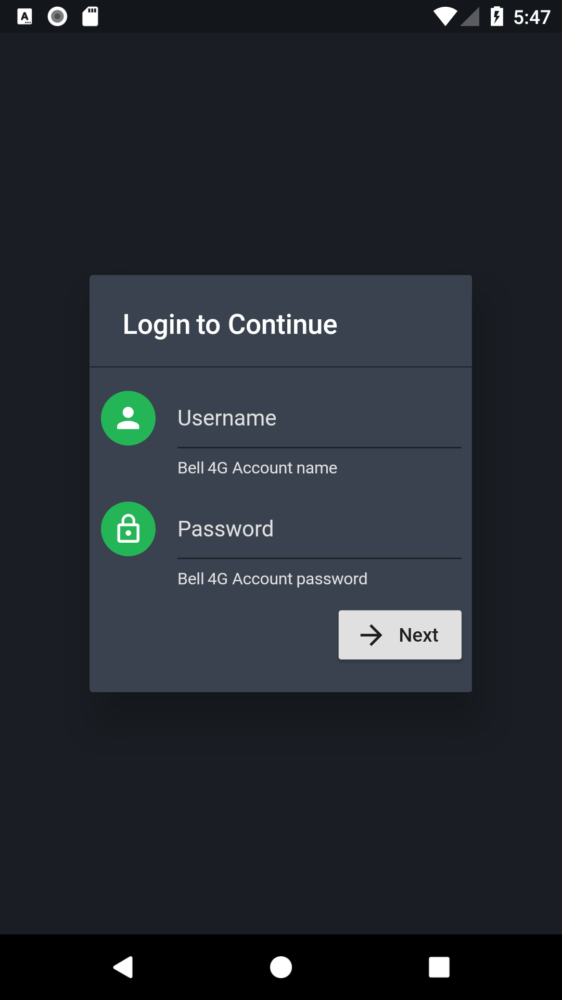
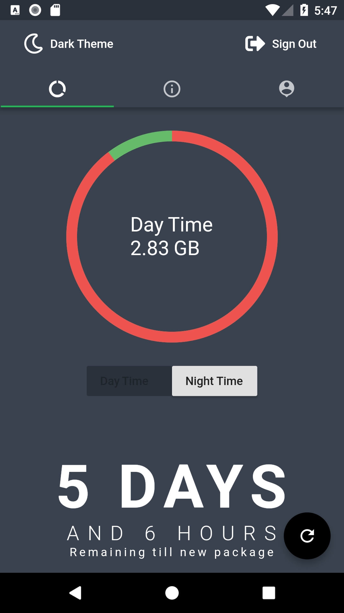
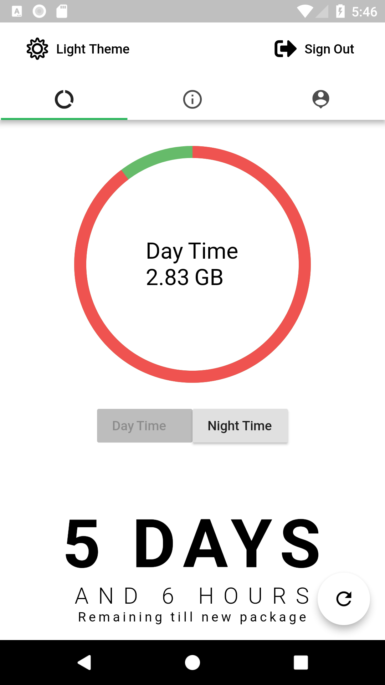
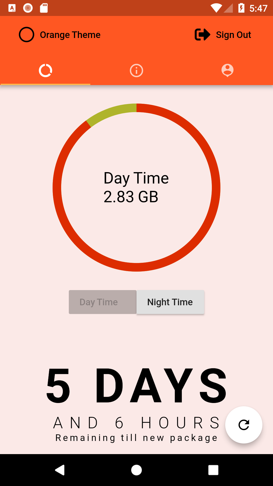
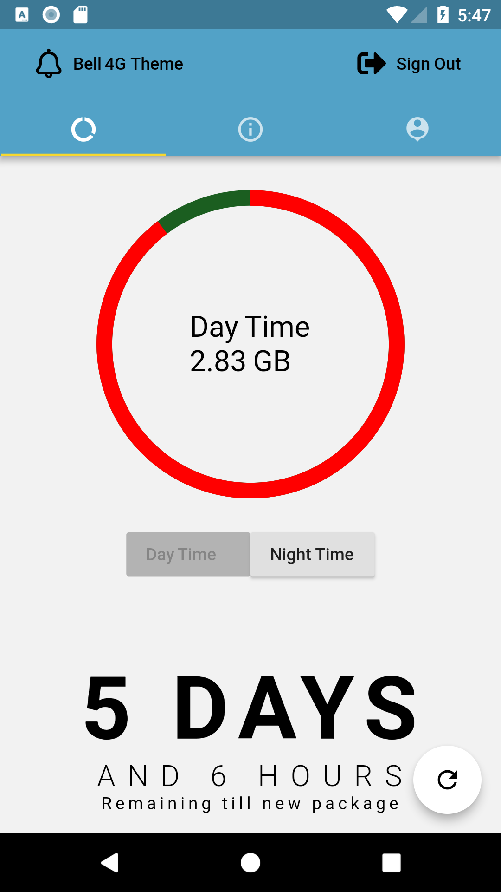

# Bell 4G Usage

Simple app to show Bell 4G Data Usage. Shows a chart and other details parsed from [Bell 4G site](http://www.lankabell.com/lte/home.jsp). Does **NOT** use a `webview` in background. This makes connections more faster and takes low usage.

## Themes

Added theme support.

Currently,

- Dark Theme
- Light Theme
- Orange Theme
- Bell 4G Theme

are included. Selected theme is persistent and will load again when restarted.

## Screenshots

### Login Page(Dark Theme)

 

------

### Info Page(Dark Theme)

------

### Info Page(Light Theme)

------

### Info Page(Orange Theme)

------

### Info Page(Bell 4G Theme)

------

## Refreshing

Problem with Bell 4G site is that it discards session after some time. So staying in sync is not possible, Thus a refresh button is introduced.

## Login Information

Login name and password will be taken using a login screen and will be saved in a secure storage location. Confirming login details will be done by logging in and then going to another page(in this case `usage.jsp`) and finding a certain string(`USAGE`) there.

> Author: kdsuneraavinash